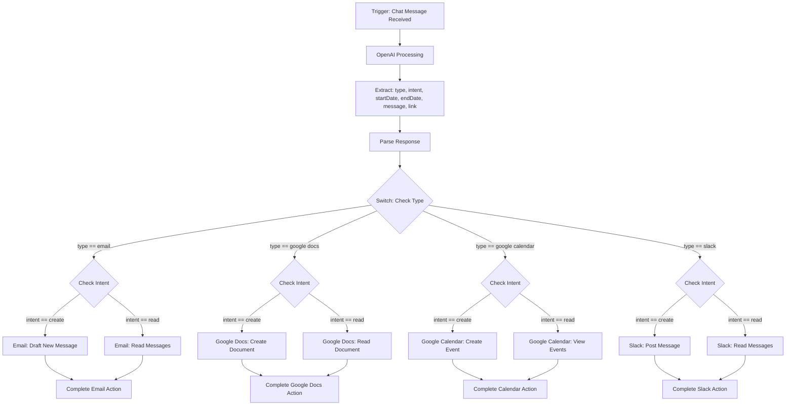
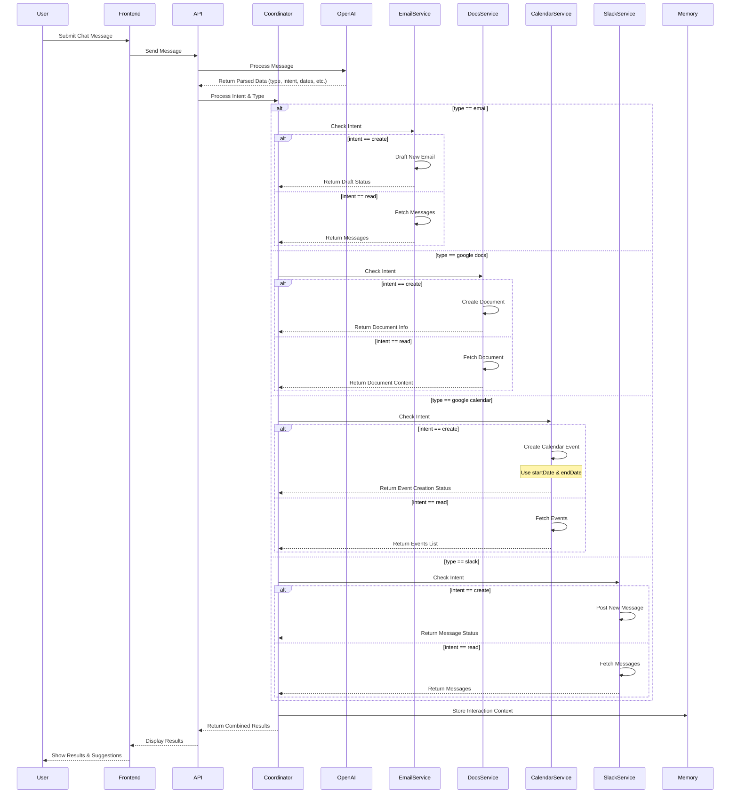
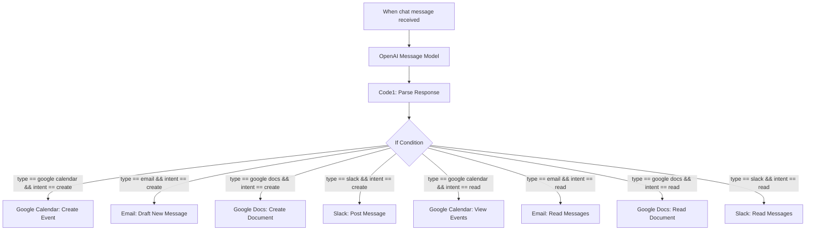

# System Architecture Flow Chart



## Workflow Description

1. The process begins with a **Chat Message Received** trigger
2. The message is sent to **OpenAI** for processing
3. OpenAI extracts key information:
   - Type (email, google docs, google calendar, slack)
   - Intent (create, read)
   - Additional data (startDate, endDate, message, link)
4. The system parses the response from OpenAI
5. A switch statement checks the **type** of request
6. Based on type, the flow branches to the appropriate service
7. For each service, the **intent** is checked to determine the specific action:
   - For **Email**: Draft new emails or read existing emails
   - For **Google Docs**: Create new documents or read existing ones
   - For **Google Calendar**: Create new events or view scheduled events
   - For **Slack**: Post new messages or read existing messages
8. Each branch completes its respective action within the target application

# Detailed Sequence Diagram



## Sequence Diagram Explanation

The detailed sequence diagram shows the complete flow of information through the system:

1. **Initial Request**:

   - User submits a chat message through the Frontend
   - The message is sent to the API

2. **Natural Language Processing**:

   - The API sends the message to OpenAI for processing
   - OpenAI returns structured data including type, intent, and other parameters

3. **Request Coordination**:

   - The Coordinator analyzes the parsed data
   - Based on the type (email, google docs, calendar, slack), it routes to the appropriate service

4. **Service-Specific Processing**:

   - Each service handles the request based on the intent (create or read)
   - Email Service: Drafts new emails or retrieves existing ones
   - Google Docs Service: Creates new documents or retrieves existing ones
   - Calendar Service: Creates new events or retrieves scheduled ones
   - Slack Service: Posts new messages or retrieves existing ones

5. **Context Management**:

   - The interaction context is stored in Memory for future reference

6. **Response Flow**:
   - Results from service operations are returned to the Coordinator
   - The Coordinator combines results and sends them back to the API
   - The Frontend displays the results to the User with relevant suggestions

# N8N Workflow Architecture

## Visual Workflow Diagram



## Workflow Description

1. The process begins with a **Chat Message Received** trigger
2. The message is sent to **OpenAI Message Model** for processing
3. **Code1** parses the response and extracts key information:
   - Type (email, google docs, google calendar, slack)
   - Intent (create, read)
   - Additional data (startDate, endDate, message, link)
4. The **If Condition** evaluates the type and intent to determine the appropriate branch
5. Based on both type and intent, the workflow routes to the appropriate service action:
   - For **Google Calendar**: Create new events or view scheduled events
   - For **Email**: Draft new emails or read existing emails
   - For **Google Docs**: Create new documents or read existing ones
   - For **Slack**: Post new messages or read existing messages

## N8N Implementation Details

### Node Configuration

1. **Trigger Node: When chat message received**

   - Type: Webhook Trigger
   - Receives incoming chat messages from the user interface

2. **OpenAI Node: Message Model**

   - Processes the natural language message
   - Returns structured data with extracted parameters
   - Configuration:
     - Model: GPT-4 or similar
     - System prompt: Instruct model to extract type, intent, dates, and other relevant information

3. **Code Node: Code1**

   - JavaScript function that parses OpenAI response
   - Extracts and validates parameters
   - Example function:

   ```javascript
   // Parse OpenAI response and extract parameters
   const response = JSON.parse(items[0].json);
   const extractedData = {
     type: response.type, // email, google docs, google calendar, slack
     intent: response.intent, // create, read
     startDate: response.startDate,
     endDate: response.endDate,
     message: response.message,
     link: response.link,
   };
   return extractedData;
   ```

4. **If Node: Conditional Branching**

   - Evaluates conditions based on type and intent
   - Routes execution to appropriate service nodes
   - Conditions:
     - `{{$node["Code1"].json["type"] == "google calendar" && $node["Code1"].json["intent"] == "create"}}`
     - `{{$node["Code1"].json["type"] == "email" && $node["Code1"].json["intent"] == "create"}}`
     - And so on for each combination

5. **Service Integration Nodes**
   - **Google Calendar Node**: For creating events or viewing calendar
   - **Email Node**: For drafting or reading emails
   - **Google Docs Node**: For creating or reading documents
   - **Slack Node**: For posting or reading messages

### Data Flow

The workflow processes data in the following sequence:

1. **Input**: User's natural language chat message
2. **Extraction**: OpenAI extracts key parameters from the message
3. **Processing**: Code1 node formats and structures the extracted data
4. **Routing**: If node routes to the appropriate service based on type and intent
5. **Action**: Service-specific node performs the requested action
6. **Response**: Results are returned to the user

## Example User Interactions

### Calendar Event Creation

User: "Schedule a meeting with the marketing team tomorrow from 2pm to 3pm"

Flow:

- OpenAI identifies: type="google calendar", intent="create", startDate="tomorrow 2pm", endDate="tomorrow 3pm", message="meeting with marketing team"
- Code1 parses these parameters
- If condition routes to Google Calendar: Create Event
- Event is created with the specified parameters

### Email Reading

User: "Check my recent emails from John"

Flow:

- OpenAI identifies: type="email", intent="read", message="from John"
- Code1 parses these parameters
- If condition routes to Email: Read Messages
- Emails from John are retrieved and displayed

### Document Creation

User: "Create a new document for project notes titled 'Project Alpha Planning'"

Flow:

- OpenAI identifies: type="google docs", intent="create", message="Project Alpha Planning"
- Code1 parses these parameters
- If condition routes to Google Docs: Create Document
- New document is created with the specified title
