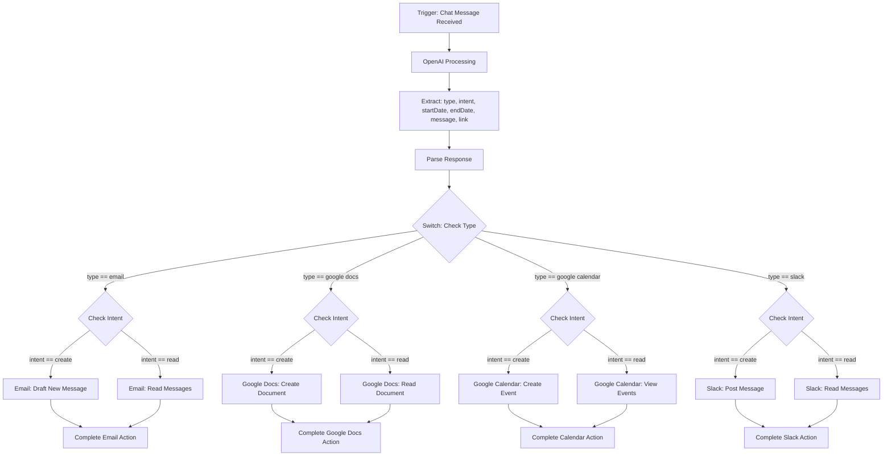

# System Architecture Flow Chart

## Workflow Description

1. The process begins with a **Chat Message Received** trigger
2. The message is sent to **OpenAI** for processing
3. OpenAI extracts key information:
   - Type (email, google docs, google calendar, slack)
   - Intent (create, read)
   - Additional data (startDate, endDate, message, link)
4. The system parses the response from OpenAI
5. A switch statement checks the **type** of request
6. Based on type, the flow branches to the appropriate service
7. For each service, the **intent** is checked to determine the specific action:
   - For **Email**: Draft new emails or read existing emails
   - For **Google Docs**: Create new documents or read existing ones
   - For **Google Calendar**: Create new events or view scheduled events
   - For **Slack**: Post new messages or read existing messages
8. Each branch completes its respective action within the target application
